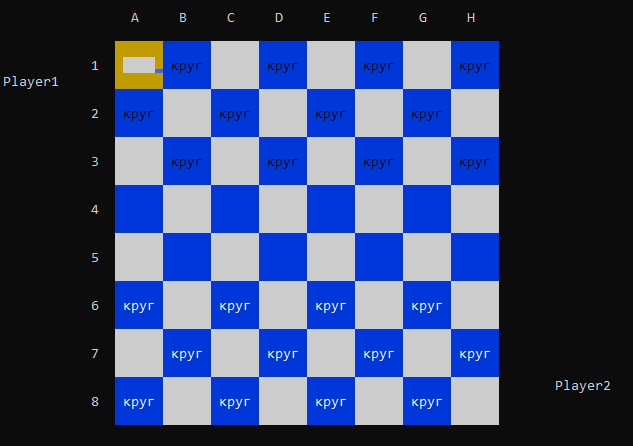
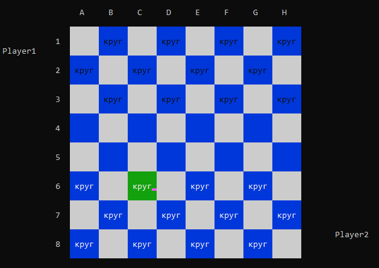
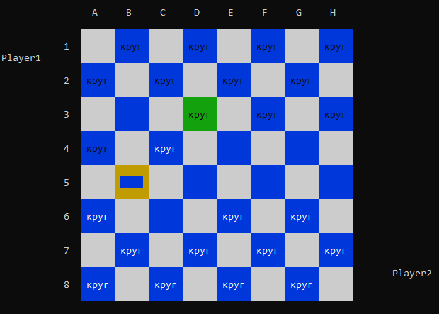
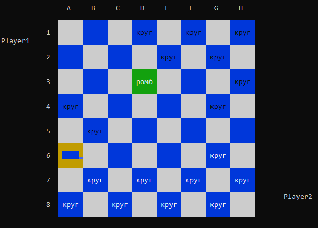
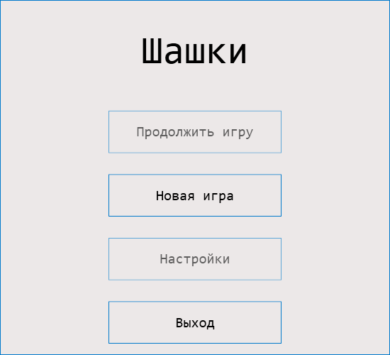
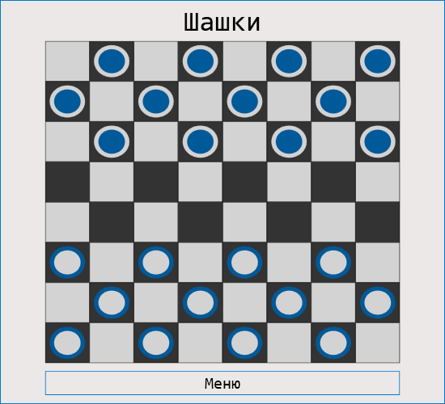
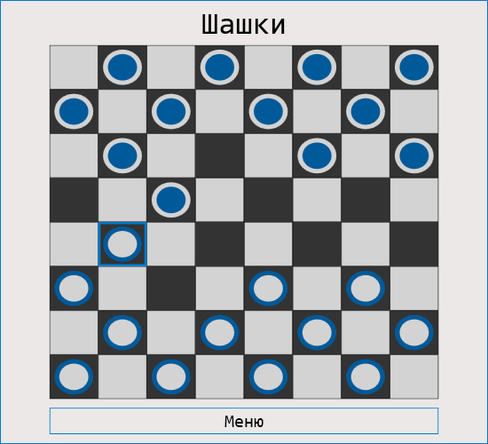
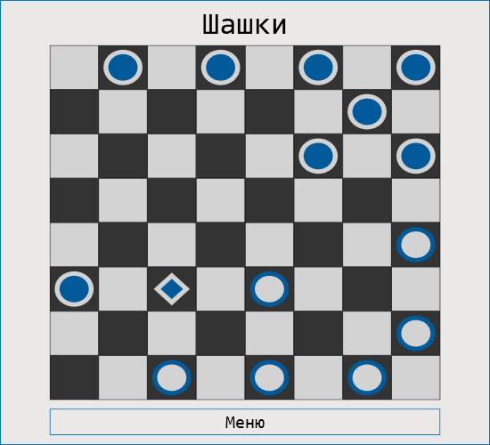
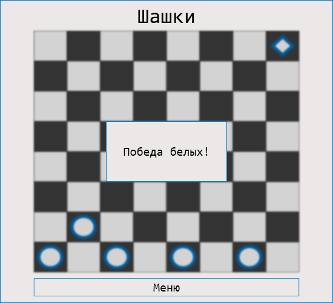

# Checkers
Implementation of a famous board game in the ```C#``` programming language.

App code incude 4 projects (for more details, click on the link):
- [__CheckersLib__](CheckersLib "Checkers library") - implementation the game logic
- [__CheckersLib.Tests__](CheckersLib.Tests "MSTest project for checkers library") - ```MSTest``` project for testing a checkers logic library
- [__CheckersConsole__](CheckersConsole "Console view") - implementation for gaming in the console
- [__CheckersUI__](CheckersUI "Window view") - implementation for gaming in the desktop window

## [Screenshots](Images)

### [Console checkers](CheckersConsole)

The game control is carried out using arrow keys: 
- __up__ ↑
- __down__ ↓
- __left__ ←
- __right__ →

Conventions:
- "круг" for a disk
- "ромб" for a king



__Yellow__ highlight is used for designation of the __current__ cell.

__Green__ highlight show __selected__ disk or king.





_The king_ named "ромб" in this implementation. Can see on the following screenshot:



### [Window checkers](CheckersUI)

On the start displayed the following view:



On click "Новая игра" button create new game.





_Circles_ are used for displaying __disks__, __kings__ get _rhombus_.



When game ended, showed alert on the screenshot:


